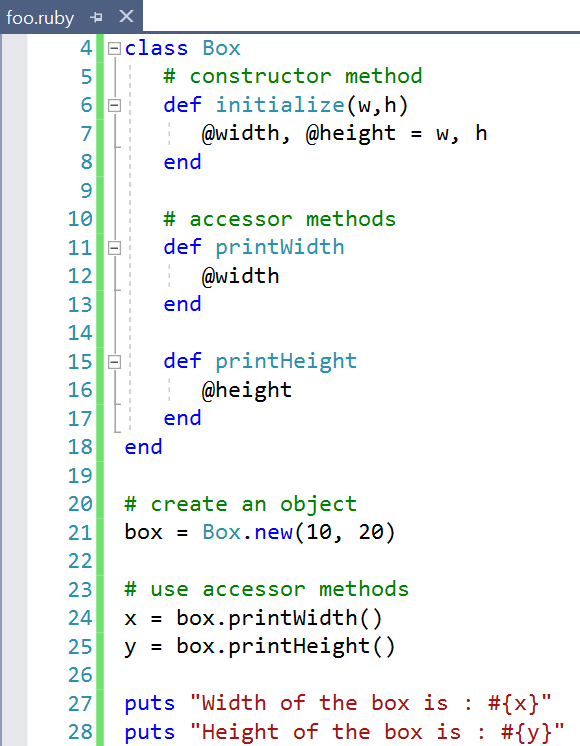
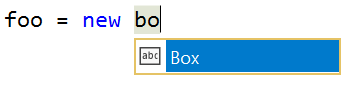
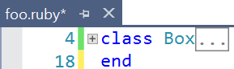

# Ruby Language Service

This adds Ruby language support to Visual Studio 2017 Update 6.

## Features

- Syntax highlighting
- Auto completion
- Outlining (code folding)
- Comment/uncomment commands

## Syntax highlighting
Any Ruby file get's syntax highlighting in the editor.

## Auto completion
Basic auto completion based on symbols in the same file is provided.

## Outlining (code folding)
Collapse and expand the code baesd on indentation levels.

## Comment/uncomment
Hit `CTRL+K,C` to turn the selection into a comment and `CTRL+K,U` to remove a comment.

## Credit
This extension is based on the [Ruby extension](https://github.com/rubyide/vscode-ruby) for Visual Studio Code.